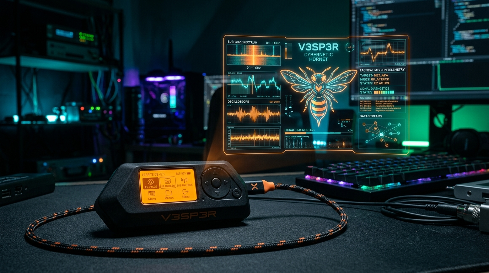
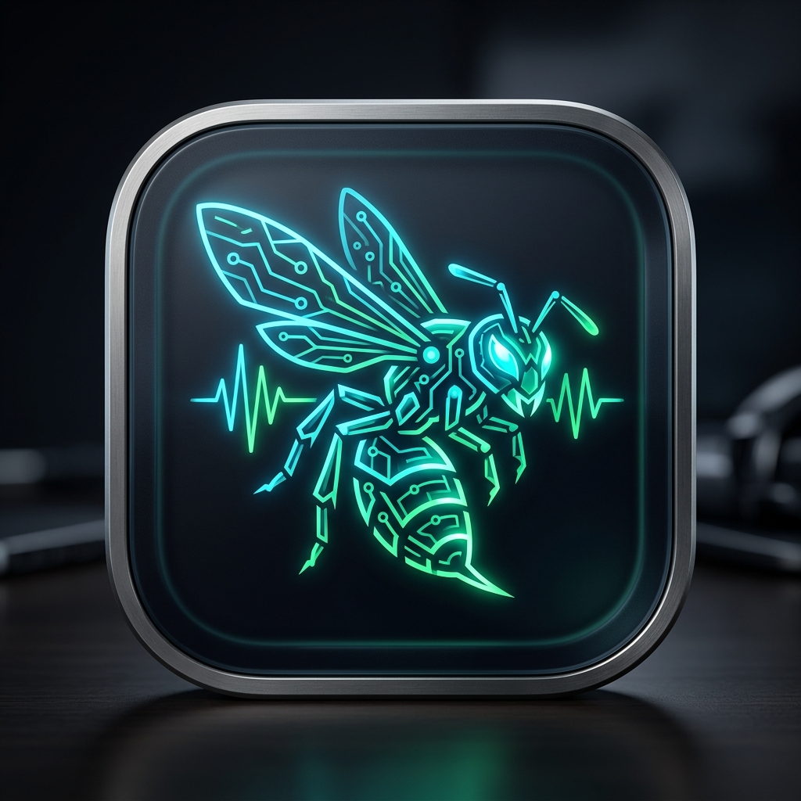

<p align="center">
  
</p>

<p align="center">
  
</p>

# V3SP3R — Sovereign AI Brain & Hardware Lab for Flipper Zero & FerriteOS

> **Talk to your hardware like it's your partner-in-hacking.** ferriteSuite turns your pocket security toolkit into an autonomous, AI-commanded hardware lab. Built as a native macOS SwiftUI command center, ferriteSuite bridges natural language reasoning directly into raw RF, Sub-GHz, NFC, RFID, Infrared, and bare-metal embedded coprocessors.

[](LICENSE)
[](macos/)
[](macos/)
[](https://github.com/ferrite-os)
[](macos/)

---

## ⚡ Highlights & State-of-the-Art Architecture

V3SP3R is engineered around dual execution tracks: a cloud/local LLM multimodal reasoning engine (OpenRouter / local models) and a **sovereign, deterministic embedded core** powered by **FerriteOS** (`crates/ferrite-*`).

```
┌───────────────────────────────────────────────────────────────────────────┐
│                          V3SP3R COMMAND CENTER                            │
│                     macOS Native (SwiftUI 6)                              │
├───────────────────────────────────────────────────────────────────────────┤
│                             AI BRAIN & ORCHESTRATION                      │
│  • OpenRouter Live Leaderboard Models (Claude Opus, Hermes 4, Sonnet 4)   │
│  • Multimodal Vision (Photo / Glasses) + Voice Recognition (Whisper / TTS)│
│  • Risk Assessor & Dual-Gated Hardware Safety Engine                      │
├──────────────────────────────────────────┬────────────────────────────────┤
│          FLIPPER ZERO PROTOCOL           │       FERRITEOS COPROCESSOR    │
│  • Dual Transport: BLE + USB CDC Serial  │  • Deterministic NLP Engine    │
│  • ProtoBuf RPC Stream & Flipper CLI     │  • 55+ Sub-GHz/NFC/RFID Decoders│
│  • ESP32 Marauder & BlackMagic Probe JTAG│  • Digital Pulse Oscilloscope  │
│  • FapHub Browser & SD Storage Manager   │  • SPEC-011 Wire Frame Engine  │
└──────────────────────────────────────────┴────────────────────────────────┘
```

---

## 🔬 FerriteOS Deep Integration

V3SP3R embeds the complete FerriteOS ecosystem as a high-speed, offline coprocessor:

### 1. Deterministic NLP & Sovereign Planning
- Offline intent extraction that transforms natural language prompts into structured hardware plans (`Verb`, `Target`, `Action`).
- Zero cloud connectivity required for mission-critical tasks.
- Unconstrained execution mode for testing, enabling instant Sub-GHz transmission, NFC UID emulation, and radio modulation.

### 2. High-Fidelity Digital Pulse Oscilloscope
- Live microsecond-level edge-transition visualizer for raw Sub-GHz radio captures (`.sub`).
- Interactive timeline viewport supporting **1x to 100x zoom**, edge scrubbing, and timing delta markers.
- Decodes Manchester, PWM, Differential Manchester, and custom pulse-width encodings in real-time.

```
+3.3V ───┐   ┌───┐       ┌───────┐   ┌───┐   ┌───
         │   │   │       │       │   │   │   │
  GND ───└───┘   └───────┘       └───┘   └───┘   
      ├── 450µs ──┤─ 900µs ──┤─ 450µs ─┤
```

### 3. SPEC-011 In-Crate Wire Protocol Engine
- Compliant with **FerriteOS SPEC-011 Wire Framing Standard** (`0xAA 0x55` sync preamble, ISO-HDLC framing, and CRC-32 integrity).
- Direct interactive simulator and hardware link testing in the macOS Workbench (`ferrite-wire`).
- Live JSON telemetry displaying frame validation, payload decompression, and link latency.

### 4. Hardware Lab & Coprocessor Flasher
- Integrated bare-metal flashing for STM32WB55 (Flipper Zero) and ESP32-S2 / ESP32-WROOM coprocessors.
- Bundled firmware images:
  - **ESP32 Marauder** (`assets/firmware/marauder/esp32_marauder_flipper.bin`)
  - **BlackMagic Probe JTAG/SWD Debugger** (`assets/firmware/blackmagic_s2/`)
  - **FerriteOS Embedded Radio Kernel**

---

## 🛠 Features Breakdown

### 🤖 Chat & Multimodal Agent
- Talk to your Flipper in plain English:
  - *"Analyze the SubGHz capture from the parking gate and check for rolling codes"*
  - *"Run a WiFi deauth scan using the Marauder backpack and save the pcap"*
  - *"Simulate an Amiibo NFC tag on sector 0"*
  - *"Tune the CC1101 radio to 433.92MHz and stream the pulse edges into the oscilloscope"*

### 📡 Spectral Alchemy Lab
- Visual waveform synthesis: draw, combine, and modulate raw RF signals.
- Export directly to `.sub` format on the Flipper SD card.
- Live frequency agility testing across 300MHz–928MHz.

### 🛡 Risk & Audit Architecture
- Real-time action risk classification:
  - **Tier 1 (Safe)**: Diagnostic telemetry, directory listings, RF signal captures.
  - **Tier 2 (Moderate)**: File writes, payload assembly, configuration changes.
  - **Tier 3 (Active)**: RF signal transmission, NFC UID cloning, BadUSB HID execution.
- Comprehensive audit trail recording every instruction, tool invocation, and hardware response.

---

## 🚀 Getting Started

### Prerequisites

| Component | Specification |
|-----------|---------------|
| **macOS App** | macOS Sonoma 14.0+ with Xcode 15+ / Swift 6.0 |
| **Hardware** | Flipper Zero (Official or Custom Firmware: Momentum / Unleashed / RogueMaster) |
| **Optional Hardware** | ESP32 WiFi Devboard (Marauder), BlackMagic Probe |

---

### macOS Quick Build & Run

```bash
# Clone the repository
git clone https://github.com/josaum/v3sp3r.git
cd v3sp3r

# Build release binary via Swift Package Manager
cd macos
swift build -c release

# Launch the ferriteSuite macOS app
open build/ferriteSuite.app
```

### Build status

| Target | Status | Notes |
|--------|--------|-------|
| macOS (`macos/`) | **Verified** | `swift build -c release` succeeds; `macos/bundle.sh` produces a signed `build/ferriteSuite.app` |

macOS is the only build target. The former Android client (`app/`) and its Gradle
scaffolding were removed; see git history to recover it.

Removing the Android client also orphaned two things that are still in the tree:

- `mentra-bridge/` relayed smart-glasses traffic to the Android app. No remaining
  code speaks that protocol, so the server currently has no client.
- `docs/architecture.md` and `docs/vesper_system.txt` documented the removed
  client and were deleted.

---

## 📂 Repository Layout

```
v3sp3r/
├── assets/
│   ├── branding/               # Brand identity (Hero banners, app icons, emblems)
│   ├── firmware/               # Coprocessor binaries (Marauder, BlackMagic Probe)
│   └── portals/                # Captive portal templates
├── crates/ (FerriteOS Subsystem)
│   ├── ferrite-agent/          # Deterministic NLP parser & offline planner
│   ├── ferrite-console/        # CLI orchestrator & host test harness
│   ├── ferrite-rf/             # 55+ Sub-GHz, NFC, and RFID decoders
│   └── ferrite-wire/           # SPEC-011 wire protocol codec & test suites
├── macos/                      # Native macOS SwiftUI 6 Application
│   ├── Sources/VesperMac/
│   │   ├── Hardware/           # Flipper BLE/Serial, FerriteOSService, SPEC-011
│   │   ├── UI/                 # Oscilloscope, Workbench, Chat, Ops Center
│   │   └── Models/             # Signal, State, and Telemetry models
│   └── Package.swift
├── mentra-bridge/              # Smart glasses bridge server (Node.js) — no client; see note
└── docs/                       # Protocol schemas
```

---

## 🔒 Security & Responsible Disclosure

V3SP3R is engineered for authorized security research, RF engineering, CTF competitions, and educational hardware exploration. Always ensure you possess explicit authorization from the target system's owner prior to testing.

---

## 📄 License

V3SP3R is released under the **GNU General Public License v3.0**. See the [LICENSE](LICENSE) file for complete details.
